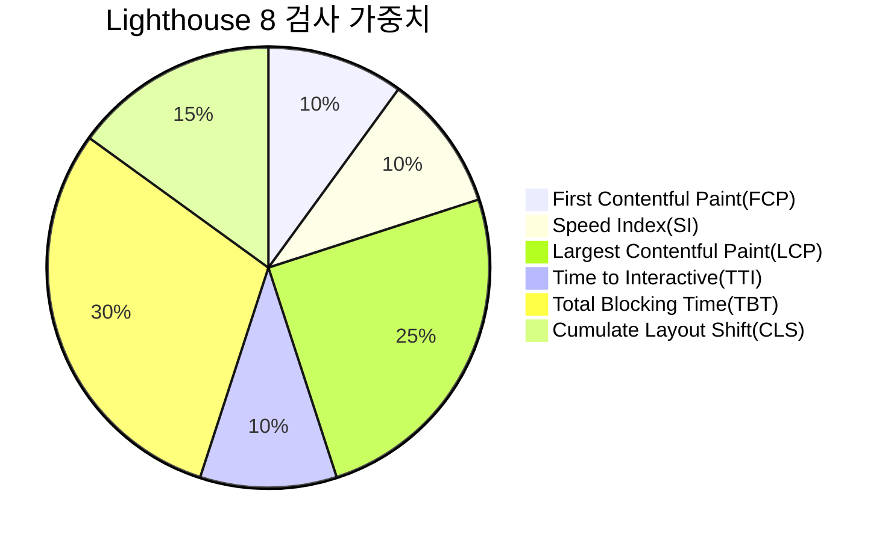
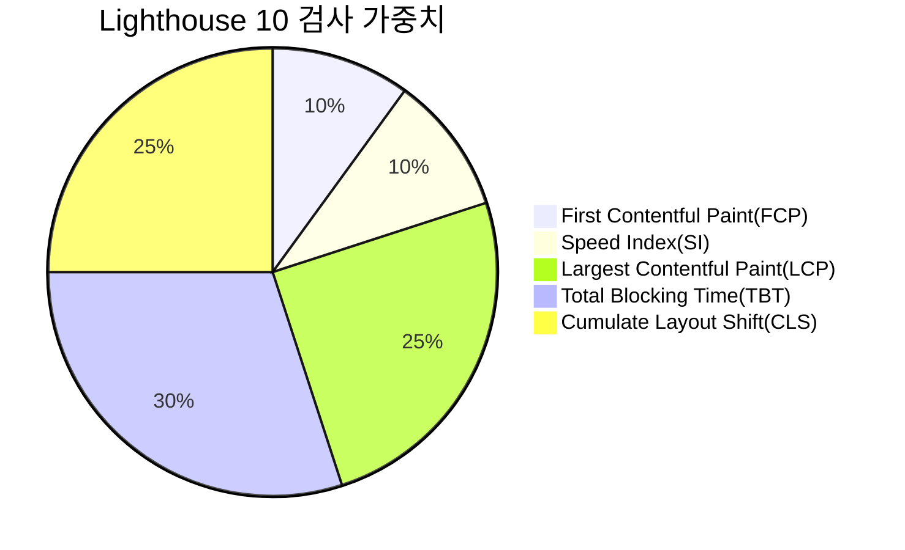

# 0. 웹 성능을 결정하는 요소

-   **로딩 성능**

    -   웹 페이지와 웹 페이지에 필요한 기타 리소스를 다운로드할 때의 성능
    -   로딩 성능 개선
        다운로드해야 하는 리소스 수를 줄이거나 크기를 줄이는 것
        -   코드 분할
        -   리소스에 우선순위를 매겨 중요한 리소스를 먼저 다운로드

-   **렌더링 성능**
    -   다운로드한 리소스를 가지고 화면을 그릴 때의 성능
    -   렌더링 성능에 크게 영향을 주는 것 -> 자바스크립트 코드
        -   코드를 얼마나 효율적으로 작성했느냐

# 1. 블로그 서비스 최적화

-   이미지 사이즈 최적화 (로딩 성능 최적화)
-   코드 분할 (로딩 성능 최적화)
-   텍스트 압축 (로딩 성능 최적화)
-   병목 코드 최적화 (렌더링 성능 최적화)

## Lighthouse

> 구글에서 만든 툴로, 웹사이트의 성능을 측정하고 개선 방향을 제시해주는 자동화 툴


-   Mode
    -   Navigation
        -   기본값
        -   초기 페이지 로딩 시 발생하는 성능 문제를 분석
    -   Timespan
        -   사용자가 정의한 시간 동안 발생한 성능 문제를 분석
    -   Snapshot
        -   현재 상태의 성능 문제를 분석
-   Categories
    -   Performance
        -   웹 페이지의 로딩 과정에서 발생하는 성능 문제를 분석
    -   Accessibility
        -   사용자 접근성 문제를 분석
    -   Best Practice
        -   웹 사이트의 보안 측면과 웹 개발의 최신 표준에 중점을 두고 분석
    -   SEO
        -   검색 엔진에서 얼마나 잘 크롤링되고 검색 결과에 표시되는지 분속
    -   Progressive Web App
        -   서비스 워커와 오프라인 동작 등, PWA 와 관련된 문제를 분석

---

### Lighthouse 검사 결과 화면





- Lighthouse 8

|Audit|Weight|
|:-:|:-:|
|First Contentful Paint|10%|
|Speed Index|10%|
|Largest Contentful Paint|25%|
|Time to Interactive|10%|
|Total Blocking Time|30%|
|Cumulative Layout Shift|15%|

- Lighthouse 10 ([2023.02.10 release](https://github.com/GoogleChrome/lighthouse/releases/tag/v10.0.0))

|Audit|Weight|
|:-:|:-:|
|First Contentful Paint|10%|
|Speed Index|10%|
|Largest Contentful Paint|25%|
|Total Blocking Time|30%|
|Cumulative Layout Shift|25%|

-   **First Contentful Paint(FCP)**
    -   브라우저가 DOM 콘텐츠의 첫 번째 부분을 렌더링하는데 걸리는 시간
-   **Speed Index(SI)**
    -   페이지 로드 중에 콘텐츠가 시각적으로 표시되는 속도
-   **Largest Contentful Paint(LCP)**
    -   회면 내에 있는 가장 큰 이미지나 텍스트 요소가 렌더링되기까지 걸리는 시간
-   **Time to Interactive(TTI)**
    -   사용자가 페이지와 상호작용이 가능한 시점까지 걸리는 시간
    -   상호작용 -> 클릭 / 키보드 누름 등의 사용자 입력
-   **Total Blocking Time(TBT)**
    -   페이지가 클릭, 키보드 입력 등의 사용자 입력에 응답하지 않도록 차단된 시간
    -   FCP - TTI 사이의 시간
    -   메인 스레드를 독점하여 다른 동작을 방해하는 작업에 걸린 시간을 총합
-   **Cumulate Layout Shift(CLS)**
    -   페이지 로드 과정에서 발생하는 예기치 못한 레이아웃 이동
    -   화면 상에서 요소의 위치나 크기가 순간적으로 변하는 것

### OPPORTUNITIES


-   페이지를 더욱 빨리 로드하는 데 잠재적으로 도움되는 제안 나열

### DIAGNOSTICS


-   로드 속도와 직접적인 관계는 없지만 성능과 관련한 기타 정보를 보여줌

### 검사 환경 확인


-   Emulated Desktop
    -   CPU 성능을 어느 정도 제한하여 검사를 진행했는지
-   Custom throttling
    -   네트워크 속도를 어느 정도로 제한하여 성능을 측정했는지
-   모바일은 상대적으로 데스크톱보다 느리기 때문에 Device 환경을 `Mobile`로 설정하면 더욱 제한된 환경으로 검사

---

## 이미지 사이즈 최적화


### 비효율적인 이미지 분석

-   이미지를 적절한 사이즈로 사용하도록 제안
-   큰 사이즈의 이미지를 사용해도 어차피 Rendered size로 밖에 보여줄 수 없다.
-   이미지 의 적절한 사이즈는?
    -   레티나 디스플레이 최적화를 위해 Rendered size 기준 두 배(x2) 정도 큰 이미지를 사용하는 것이 적절
-   적절한 사이즈로 이미지를 받아오는 방법
    -   이미지 CDN

### 이미지 CDN

> CDN(Content Delivery Network)

-   물리적 한계를 극복하기 위해 사용자와 가까운 곳에 콘텐츠 서버를 두는 기술
-   대표적인 이미지 CDN: `Imgix`

## 병목 코드 최적화

크롬 개발자 도구 Performance 패널 -> 새로 고침 버튼 → 페이지가 다시 로드되면서 작업(네트워크, 메인 스레드 등)을 기록


**분석 결과 확인하기**


1. CPU 차트, Network 차트, 스크린샷


- **CPU 차트**
   - 시간에 따라 CPU가 어떤 작업에 리소스를 사용하고 있는지 비율로 보여줌
   - 어느 타이밍에 어떤 작업이 주로 진행되고 있는지 파악할 수 있다. 
   - 노란색: 자바스크립트 실행
   - 보라색: 렌더링 / 레이아웃 작업
   - 초록색: 페인팅 작업
   - 회색: 기타 시스템 작업
   - 빨간색 선: 병목이 발생하는 지점 → 특정 작업이 메인 스레드를 오랫동안 잡아두고 있다.

- **Network chart**
   - 진한 막대 : 우선순위가 높은 네트워크 리소스
   - 옅은 막대 : 우선순위가 낮은 네트워크 리소스

- **스크린샷**
   - 서비스가 로드되는 과정을 보여줌

2. Network 타임라인
   - Network 패널과 유사하게 서비스 로드 과정에서의 네트워크 요청을 시간 순서에 따라 보여줌


3. Frames, Timing, Main

- **Frames**
   - 화면의 변화가 있을 때마다 스크린샷을 찍어보여줌
    

- **Timing**
   - User Timing API를 통해 기록된 정보를 기록
   - 여기 표시된 막대들은 리액트에서 각 컴포넌트의 렌더링 시간을 측정한 것이다.   
    

   > 리액트의 User Timing API 코드는 리액트 버전 17이후로 지원 종료.

- **Main**
   - 브라우저의 메인 스레드에서 실행되는 작업을 플레임 차트로 보여줌
   - 어떤 작업이 오래 걸리는지 파악할 수 있다.
    

4. 하단 탭

- **Summary**
   - 선택 영역에서 발생한 작업 시간의 총합
   - 각 작업이 차지하는 비중
- **Bottom-Up**
   - 가장 최하위에 있는 작업부터 → 상위 작업까지 역수능로
- **Call Tree**
   - 가장 상위 작업 → 하위 작업 순으로 작업 내용을 트리뷰(Tree view)로 보여줌
- **Event Log** 
   - 발생한 이벤트를 보여줌
   - Loading, Experience, Scripting, Rendering, Painting 

### 페이지 로드 과정


- `0.chunk.js`의 로드 시간이 매우 길다 
- 추적해보니 Article 컴포넌트가 렌더링되는 과정에서 `removeSpecialCharacter` 함수가 아주 오래 실행된 것을 확인할 수 있다. 


### 병목 코드 개선 (`removeSpecialCharacter`)

```diff
/*
 * 파라미터로 넘어온 문자열에서 일부 특수문자를 제거하는 함수
 * (Markdown으로 된 문자열의 특수문자를 제거하기 위함)
 * */
function removeSpecialCharacter(str) {
-  const removeCharacters = ['#', '_', '*', '~', '&', ';', '!', '[', ']', '`', '>', '\n', '=', '-']
-  let _str = str
+  let _str = str.substring(0,300)
-  let i = 0,
-    j = 0
-
-  for (i = 0; i < removeCharacters.length; i++) {
-    j = 0
-    while (j < _str.length) {
-      if (_str[j] === removeCharacters[i]) {
-        _str = _str.substring(0, j).concat(_str.substring(j + 1))
-        continue
-      }
-      j++
-    }
-  }
+ _str = _str.replace(/[#_*~&;![\]`>\n=\->]/g, '')
  return _str
}
```
- 중첩된 반복문 → 정규 표현식 사용(`replace`)
- 필요한 내용만 잘라 사용
   - `str.substring(0,300)` 

## 코드 분할


유난히 크고 다운로드가 오래 걸렸던 `0.chunk.ks`

- 화면을 그리는데 필요한 리소스의 다운로드가 늦어지면
   - 다운로드가 완료된 후에나 화면을 그릴 수 있기 때문에
   - 다운로드가 오래 걸린 만큼 화면도 늦게 뜬다. 

### 번들 파일 분석

- [`Webpack Bundle Analyzer`](https://www.npmjs.com/package/webpack-bundle-analyzer)
   - webpack을 통해 번들링된 번들 파일이 어떤 코드로 이루어져 있는지 트리맵으로 시각화하여 보여줌
    
   - 이 패키지를 사용하려면 webpack 설정을 수정해야 함
      - `npm run eject` → CRA 설정 파일들을 추출해야 함

- [`cra-bundle-analyzer`](https://www.npmjs.com/package/cra-bundle-analyzer)
    - `Webpack Bundle Analyzer`를 내부적으로 사용
    - 결과물은 동일하지만 CRA 프로젝트에서 `eject` 없이 사용할 수 있다. 
    ```bash
    npm install --save-dev cra-bundle-analyzer
    npx cra-bundle-analyzer
    ```
    - 파일의 실제 크기에 따라 비율로 보여주기 때문에, 어떤 패키기자 어느 정도 용량을 차지하고 있는지도 쉽게 알 수 있다.

### 번들 파일 분석 결과 → 크기가 큰 번들 파일 코드 분할 & 지연 로딩

**코드 분할**

> 코드를 분할하는 기법으로 하나의 번들 파일을 여러 개의 파일로 쪼개는 방법

- 분할된 코드는 사용자가 서비스를 이용 하는 도중 해당 코드가 필요해지는 시점에 로드되어 실행 → 지연 로딩
- 코드 분할의 여러가지 패턴

    

   - 페이지 별로 코드 분할
   - 모듈 별로 분할
- 불필요한 코드 또는 중복되는 코드 없이 적절한 사이즈의 코드가 적절한 타이밍에 로드되도록 하는 것

### 코드 분할 적용

**기본 import**

```js
import { add } from './math'

console.log('1 + 4 = ', add(1, 4))
```
- 빌드 시 번들링

**동적 import**

```js
import('add').then((module) => {
    const { add } = module

    console.log('1 + 4 = ', add(1,4))
})
```

- 런타임에 해당 모듈 로드
- Promise 형태로 모듈을 반환한다.
- 리액트에서 import 하려는 모듈은 컴포넌트이기 떄문에 Promise 내부에서 로드된 컴포넌트를 Promise 밖으로 빼내야 한다.
    - 리액트는 이런 문제를 해결하기 위해 `lazy`, `Suspense`를 제공한다.
    - [React Suspense](https://velog.io/@sasha1107/React-Suspense)

        ```jsx
        import React, { Suspense } from 'react'

        const SomeComponent = React.lazy(()=> import('./SomeComponent'))

        function MyComponent() {
            return (
                <div>
                    <Suspense fallback={<div>Loading...</div>}>
                        <SomeComponent />
                    </Suspense>
                </div>
            
            )
        }
        ```

- `lazy` 함수는 동적 `import`를 호출하여 그 결과인 Promise를 반환하는 함수를 인자로 받는다. 
    - lazy 함수가 반환한 import한 컴포넌트는 `Suspense` 안에서 렌더링해야 한다.
    - 동적 import를 하는 동안 SomeComponent가 아직 값을 갖지 못할 때는 Suspense의 fallback prop에 정의된 내용으로 렌더링되고
    - 이후 SomeComponent가 온전히 로드됐을 때 fallback 값으로 렌더링된 Suspense가 정상적으로 SomeComponent를 렌더링한다.

```diff
-import React from 'react'
+import React, { Suspense, lazy } from 'react'
import { Switch, Route } from 'react-router-dom'
import './App.css'
-import ListPage from './pages/ListPage/index'
-import ViewPage from './pages/ViewPage/index'
+const ListPage = lazy(() => import ('./pages/ListPage/index')) 
+const ViewPage = lazy(() => import ('./pages/ViewPage/index')) 

function App() {
  return (
    <div className="App">
+    <Suspense fallback={<div>로딩 중 ...</div>}>
      <Switch>
        <Route path="/" component={ListPage} exact />
        <Route path="/view/:id" component={ViewPage} exact />
      </Switch>
+    </Suspense>
    </div>
  )
}

export default App
```

## 텍스트 압축 (Enable text compression)

### production VS development

- production 환경
    - webpack에서 추가적인 최적화 작업
        - 경량화
        - 난독화(uglify) 등 

> 최종 서비스의 성능을 측정할 때는 production 환경으로 빌드된 서비스의 성능을 측정해야 한다.

### 텍스트 압축 적용
- HTML, CSS, JS 파일을 압축하여 작은 크기로 빠르게 전송한 뒤, 사용하는 시점에 압축을 해제
- 번들 파일의 사이즈 줄일 수 있고
- 번들 파일 응답 헤더
    - `Content-Encoding`: `gzip`
### 압축 여부 확인

HTTP 헤더 -> `Content-Encoding : gzip`


### 압축 방식
- `Gzip`
    - 블록화, 휴리스틱 필터링, 헤더와 체크섬
    - 내부적으로 Deflate 사용
    - Deflate 보다 더 좋은 압축률 제공
- `Deflate`
    - LZ777알고리즘 & 허프먼 알고리즘을 사용하여 데이터를 감쌈

- - -

# 질문 🤔

TTI 항목이 Lighthouse 검사 가중치 항목에서 제외된 이유는?