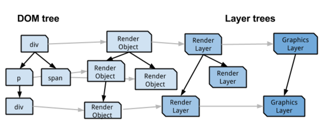
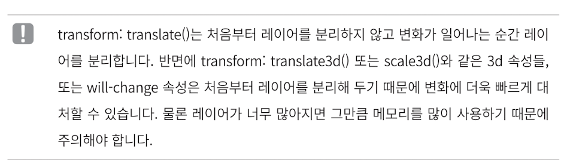
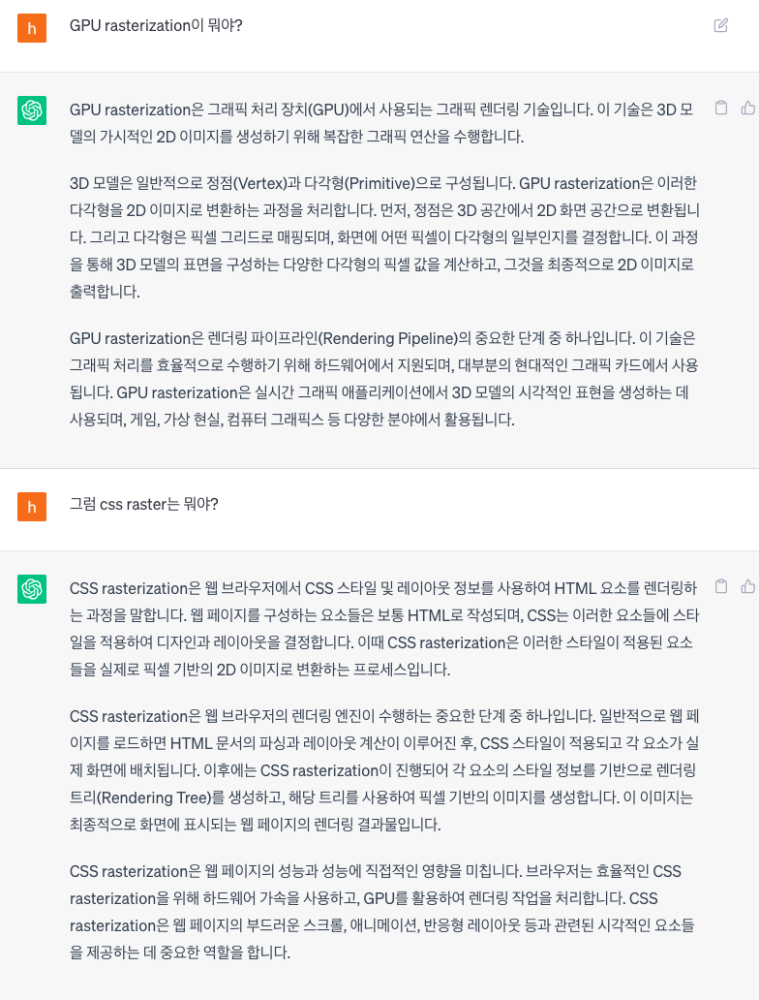

# 2. 올림픽 통계 서비스 최적화

# CSS 애니메이션 최적화

> 쟁크(jank)
> 애니메이션이 부드럽지않고 끊기는듯 동작하는것처럼 보임

## 애니메이션의 원리

- 애니메이션의 원리는 여러장의 이미지를 빠르게 전환하여 우리눈에 잔상을 남기고, 그로인해 연속된 이미지가 움직이는것처럼 느껴지게 하는것
- 일반적으로 사용하는 디스플레이의 주사율은 60Hz이고(1초에 60장의 정지된화면을 보여줌), 브라우저도 이에맞춰 최대 60FPS로 1초에 60장의 화면을 새로 그린다.

## 브라우저의 렌더링 과정

- 렌더 트리는 화면에 표시되는 각 요소의 레이아웃을 계산하는데 사용된다.

### 페인트

- 브라우저는 효율적인 페인트 과정을 위해 구성요소를 여러개의 레이어로 나눠서 작업하기도한다.

### 컴포지트

- 각 레이어를 합성하는 작업을 한다.

---

- 리플로우는 주요 렌더링 경로의 모든 단계를 모두 재실행한다. > 브라우저의 리소스를 많이 사용한다.
- 리페인트는 레이아웃단계는 건너뛰지만 페인트와 컴포지트 작업을 다시 반복한다. > 그래도 리소스를 많이 사용한다.
- 리플로우와 리페인트를 피하면서 화면을 변경시킬수있는 방법이 있다 > trasform, opacity!!
- 이 속성들은 해당요소를 별개의 레이어로 분리하고 작업을 GPU에 위임하여 처리함으로써 레이아웃 단계와 페인트단계를 건너뛸수있다.

**하드웨어 가속**

- CPU에서 처리해야할 작업을 GPU에 위임하여 더욱 효율적으로 처리하는 방법
- 특정 요소에 하드웨어 가속을 사용하려면 요소를 별도의 레이어로 분리하여 GPU보내야하는데 transform과 opacity가 이 역할을 한다.
- will-change : 요소에 예상되는 변화의 종류에 관한 힌트를 브라우저에 제공한다. 그래서 실제 요소가 변화되기전에 미리 브라우저는 적절하게 최적화 할수있음

  ```css
  /* 키워드 값 */
  will-change: auto;
  will-change: scroll-position;
  will-change: contents;
  will-change: transform; /* Example of <custom-ident> */
  will-change: opacity; /* Example of <custom-ident> */
  will-change: left, top; /* Example of two <animateable-feature> */

  /* 전역 값 */
  will-change: inherit;
  will-change: initial;
  will-change: unset;
  ```

# 컴포넌트 지연 로딩

- 코드분할 기법

# 컴포넌트 사전 로딩

- **해당 코드가 필요한시점보다 먼저 코드를 로드하는 기법**
- 지연 로딩을 하면 해당 컴포넌트를 사용하려고할때 코드를 추가로 다운로드하는동안 지연이 발생함
- 지연로딩은 초기화면 로딩에는 효과적일지몰라도 모달을 띄우는시점에는 지연이 발생하는거기떄문에 사용성 개선에 한계가 있음 > 모달을 띄우기까지 약간의 지연이 발생

---

- 사전 로딩의 타이밍을 고려해야함!

# 이미지 사전 로딩

- Image 객체

```css
const img = new Image();
img.src = "{이미지 주소}"
```

- 위 코드가 실행되면 이미지가 다운로드된다.

# ⁉️ 키워드

## [하드웨어 가속](https://d2.naver.com/helloworld/2061385)(GPU 가속)

- GPU를 활용하기때문에 GPU가속이라고도 부른다.
- 브라우저는 화면에 표현되는 요소를 RenderObject 트리로 구성한다.
  그리고 RenderObject 트리의 노드는 z-index 속성이나 중첩을 처리하기위해 고안된 RenderLayout에 대응된다.
  그리고 RenderLayout 중 화면에 출력돼야하는 노드는 다시 GrapicsLayer를 생성한다. (root 노드나, canvas, video 등이 GrapicsLayer를 생성하는 renderLayout이다.)



### 가속 대상

- RenderLayer에 포함되는 요소 가운데 다음의 조건 중 한가지에 부합되면 GraphicsLayer로 설정된다

1. CSS 3D Trasform(translate3d, preserve-3d)이나 perspective 속성이 적용된 경우

   

2. `<video>`, `<canvas>` 요소
3. css3 애니메이션함수나 [CSS 필터함수](https://developer.mozilla.org/en-US/docs/Web/CSS/filter)를 사용하는 경우

> 필터 CSS 속성은 흐림 또는 색상 변화와 같은 그래픽 효과를 요소에 적용합니다. 필터는 일반적으로 이미지, 배경 및 테두리의 렌더링을 조정하는 데 사용됩니다

1. 자식요소가 레이어로 구성된경우
2. z-index 값이 낮은 형제 요소가 레이어로 구성된 경우. 레이어로 구성된 요소의 위에 위치하면 해당 요소도 레이어로 구성된다. < ???????????? 무슨말이지..

## 하드웨어 가속 사용 시 고려사항

### 웹페이지의 렌더링 속도가 빨라지지만 잘못 사용하면 오히려 렌더링 속도가 느려지거나 브라우저에 문제가 일어날 수 있다.

1. 무분별한 하드웨어 가속은 오히려 브라우저를 느리게한다.
2. 요소에 하드웨어 가속 속성이 부여되면 즉시 대상 영역이 GPU에 업로드되며, 이떄 업로드되는 영역이 크면 화면이 깜빡이는 현상이 발생될 수 있다,
3. 요소에 하드웨어 가속 속성이 부여되면 레이어로 분리되며, 레이어는 변경되는 내용이 없는 한 요소를 GPU 메모리에 다시 업로드하지 않는다.
4. 하드웨어 가속 속성을 사용한 요소의 내용이 변경되면 GPU 메모리가 갱신되므로 요소의 내용을 미리 변경한 다음 하드웨어 가속 속성을 부여한다.
5. 성능이 낮은 기기에서 하드웨어 가속을 사용하면 오히려 성능 저하를 가져올 수 있다.

## 하드웨어 가속 시 고려할점

1. 하드웨어 가속을 적용하는 요소의 크기는 작을수록 좋고, 요소의 개수는 화면에서 5~6개로 구성하는 것이 좋다.
2. DOM 요소의 내용이 자주 변경되지 않는 영역에 하드웨어 가속을 적용한다. 내용 변경이 아닌 이동이나 크기 변경이 자주 발생하는 영역에 하드웨어 가속을 적용하고, 이동이나 크기 변경은 `transform` 속성을 사용한다.

## **will-change 속성**

- 어떤 특정한 요소에 하드웨어 가속을 적용하고 싶을 때 사용한 방법이 레이어 핵(layer hack)이다.
- 레이어 핵은 하드웨어 가속을 위해 요소에 CSS 3D 속성을 부여해 요소를 **GraphicsLayer로 만드는**, 일종의 '핵(hack)'이다.
- 미래에 변경이 발생할 속성에 관해 브라우저에 힌트를 주는 것이라고 생각하면 된다.

# CSS Rasterization


