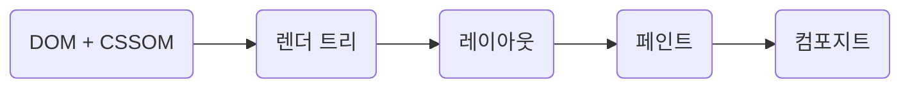
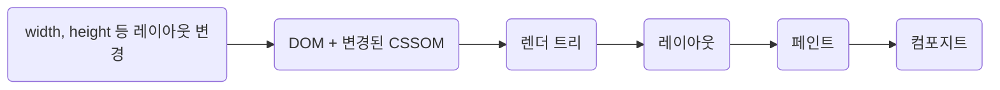
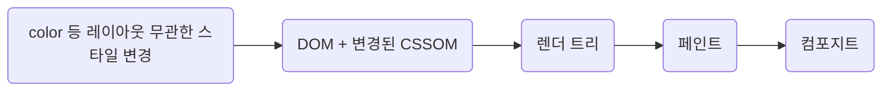

# 2. 올림픽 통계 서비스 최적화

## CSS 애니메이션 최적화

**쟁크(Jank) 현상**

>  쟁크(Jank)는 사이트나 앱이 주사율에 맞추지 못하고 더듬거리며 요동치거나 잠시 멈춘다는 것을 사용자가 보는 것을 말한다. 브라우저가 프레임을 만드는데 너무 많은 시간이 걸려서 쟁크가 생긴 것으로, 사이트나 앱에 대한 사용자 경험에 부정적인 영향을 미친다. 로 번역할 수 있다.

### 애니메이션의 원리

- 일반적으로 사용하는 디스플레이의 주사율은 60Hz
    - 1초에 60장의 정지된 화면을 빠르게 보여줌
    - 브라우저도 이에 맞춰 최대 60FPS로 1초에 60장의 화면을 새로 그린다.

- 쟁크 현상의 원인
    - CPU가 바빠서
    - 브라우저가 정상적으로 60FPS로 화면을 그리지 못했기 때문

### 브라우저 렌더링 과정


### 리플로우 

- 변경 사항이 문서 내용이나 구조 또는 요소 위치에 영향을 미쳤을 때
    - DOM 조작(요소 추가, 삭제)
    - Form field 의 텍스트 변경을 포함한 내용 변경
    - CSS 추가 또는 제거
    - 브라우저 창 조작(크기 조작, 스크롤)
    - 의사 클래스 활성화(`:hover`)
- 주요 렌더링 경로의 모든 단계 재실행 -> 브라우저 리소스를 많이 사용함



### 리페인트

- 요소의 위치에 영향을 주지 않는 요소의 스타일을 변경하는 경우
    - `color`, `visibility`, `text-decoration`, `background-position`, `outline-color`, `outline-style`, `outline-width`, `background-size`, `border-style`, `background`, `background-image`, `background-repeat`, `outline`, `border-radius`, `box-shadow`
- 레이아웃 단계 스킵
- 하지만 리페인트 역시 주요 렌더링 경로의 **거의** 모든 단계를 거침 -> 브라우저 리소스 많이 사용


### 하드웨어 가속 (GPU 가속)
- 리플로우 & 리페인트 피하는 방법
- `transform`, `opacity`
    - 해당 요소를 별도의 레이어로 분리
    - CPU에서 처리해야할 작업을작업을 GPU에 위임하여 처리
    - 레이아웃 & 페인트 단계 건너뜀

## 컴포넌트 지연 로딩
- 모달 컴포넌트는 첫 페이지 로딩 시 바로 필요한 코드가 아니기 때문에 dynamic import
    - `lazy()` + `<Suspense>`

## 컴포넌트 사전 로딩
- 컴포넌트 지연 로딩의 단점
    - 초기화면 로딩 시에는 효과적일지 몰라도
    - 모달을 띄울 때 네트워크를 통해 모달 코드를 새로 로드해야 함
    - 로드가 완료되어야 모달을 띄울 수 있기 때문에
    - 모달이 뜨기까지 약간의 지연이 발생

### 사전 로딩(Preloading)

> 필요한 모듈을 필요해지기 전에 미리 로드하는 기법

**사전 로딩 타이밍은?**

1. 사용자가 버튼 위에 마우스를 올려놨을 때(`mouseenter`)
2. 최초에 페이지가 로드되고 컴포넌트의 마운트가 끝났을 때 (`componentDidMount`)

> 중요한 것은 어느 타이밍에 사전 로드하는 것이 해당 서비스에서 가장 합리적인지 판단하는 일

### 1. 버튼 위에 마우스를 올려놓았을 때 사전 로딩

- 버튼 컴포넌트의 `onMouseEnter` 이벤트 
- 버튼을 클릭할 때, 마우스 커서를 버튼 위에 올리고 클릭하기까지 대략 300~600 밀리초 정도 시간 차가 있다.
    - 아주 찰나의 순간이긴 하지만 브라우저가 새로운 파일을 로드하기에는 충분하다.

```jsx
function App () {
    const [showModal, setShowModal] = useState(false)

    const handleMouseEnter = () => {
        const component = import('./components/ImageModal)
    }
    
    return (
        <div className='App'>
        // ...생략
            <button
                onMouseEnter={handleMouseEnter}
                onClick={() => setShowModal(true)}
            >
                올림픽 사진 보기
            <button>
        </div>
    )
}
```
### 2. 컴포넌트 마운트 완료 후 사전 로딩

- 클래스형 컴포넌트라면 `componentDidMount` 시점
- 함수형 컴포넌트라면 `useEffect` 시점

```jsx
function App () {
    const [showModal, setShowModal] = useState(false)

    useEffect(() => {
        const component = import('./components/ImageModal)
    }, [])
    
    return (
        <div className='App'>
        // ...생략
        </div>
    )
}
```
## 이미지 사전 로딩

- 이미지가 제때 뜨지 않으면 Layout Shift가 발생할 수 있다.
- 이미지가 화면에 제때 뜰 수 있도록 미리 다운로드하는 기법
- 자바스크립트의 Image 객체 사용하여 자바스크립트로 이미지 직접 로드
    - new 연산자로 이미지 객체 생성
    - 생성된 인스턴스의 src 속성에 원하는 이미지의 주소를 입력하면 해당 이미지를 로드할 수 있다.

```js
const img = new Image()
img.src = `{IMG_URL}`
```

### 이미지 사전 로딩 코드로 적용

- 모달에서 가장 먼저 보이는 이미지 사전 로드
- 이미지 사전 로딩이 가능한 이유
    - 이미지를 로드할 때 브라우저가 해당 이미지를 캐싱해두기 때문
    - 'Disable cache' 옵션이 체크되어 있으면 이미지 리소스에 대해 캐시를 하지 않아 매번 새로 불러옴
- 추가 고민거리 🤔
    - 몇 장의 이미지까지 사전 로드해둘 것인가
    - 너무 많은 이미지 사전로드 > 그만큼 브라우저 리소스를 많이 사용하기 때문에 다른 성능 문제를 야기할 수도 있다.
    - 정말 사전 로딩이 필요한 이미지인지
```js
useEffect(() => {
    const img = new Image()
    img.src = '{IMG_URL}'
}, [])
```
- - -

# 같이 논의하면 좋을 내용

> 하드웨어 가속 --> 성능 최적화?

- - -

## 컴포지팅
- CPU와 GPU가 만들어낸 레이어들을 Composite 과정에서 조합해서 화면에 요소들을 출력
- GPU 사용으로 부드럽고 빠른 애니메이션 효과
- 애니메니션이 더 이상 CPU에 묶여있지 않게 된다.
- Graphics Layer가 생성되는 경우
    - video나 canvas 태그를 사용하는 경우
    - 하드웨어 가속 플러그인을 사용하는 경우
    - 3d transform 속성이 존재하는 경우
    - 하드웨어 가속이 된 2D canvas 요소인 경우
    - backface-visibility attribute가 hidden인 경우
    - transition, animation 속성이 있는 경우
    - will-change를 설정한 경우 (opacity, transform, top, left 등..)

### 컴포지팅이 일어나는 과정
- GPU는 원격 서버와 비슷하기 때문에
- 브라우저는 페이로드를 먼저 생성하여 이를 기기로 전송해야 한다.
- 페이로드를 형성하는 것과 이 데이터를 GPU로 보내는 과정을 간략하게 요약한 것
    - 각각의 컴포짓 레이어를 개별적인 이미지로 페인트한다.
    - 레이어 데이터(크기, 오프셋, 투명도 등)를 준비한다.
    - (적용할 수 있으면)애니메이션에 적용할 쉐이더를 준비한다.
    - GPU로 데이터를 보낸다.
### 암묵적 컴포지팅
- 쌓임 순서 때문에 컴포짓 레이어 위에 존재하는 요소보다 위에 와야 하는 경우, 이 요소들 때문에 컴포짓 레이어가 암묵적으로 추가 생성된다.
    - 별도의 이미지로 페인팅 되어 GPU에 보내지게 되는 것.
### 메모리 낭비

- 컴포짓 레이어 하나가 차지하는 메모리
    - 예) 320px * 240px 이미지를 저장할 때 필요한 메모리
        - 픽셀 수 (320 * 240) * 3 = 307,200 바이트
        - 3을 곱하는 이유
            - 픽셀은 하나당 3바이트(RGB)로 이루어져 있기 때문
            - 이미지가 투명한 영역을 포함하고 있다면, 4바이트(RGBa)
- 모든 컴포짓 레이어는 추가적으로 메모리를 소모한다.
    - 메모리는 모바일 기기에서 매우 귀중한 자원이다. 
    - 메모리 과다 사용은 브라우저 충돌을 일으킬 수 있다.
- 암묵적 컴포지팅을 고려사항에 넣지 않는다면, 느린 리페인팅, 메모리 초과 사용이 발생할 가능성이 매우 놓다. 

- 참고
    - [(번역) CSS GPU 애니메이션 제대로 하기](https://wit.nts-corp.com/2017/08/31/4861)
    - [브라우저의 Layer Model과 하드웨어 가속을 이용한 렌더링 최적화에 대해 알아보자!](https://ssocoit.tistory.com/259)
    - [브라우저에서 페이지를 렌더링하는 방식](https://ajdkfl6445.gitbook.io/study/web/browser-rendering#composite)
    - [Chrome User Agent Style](https://chromium.googlesource.com/chromium/blink/+/master/Source/core/css/html.css)