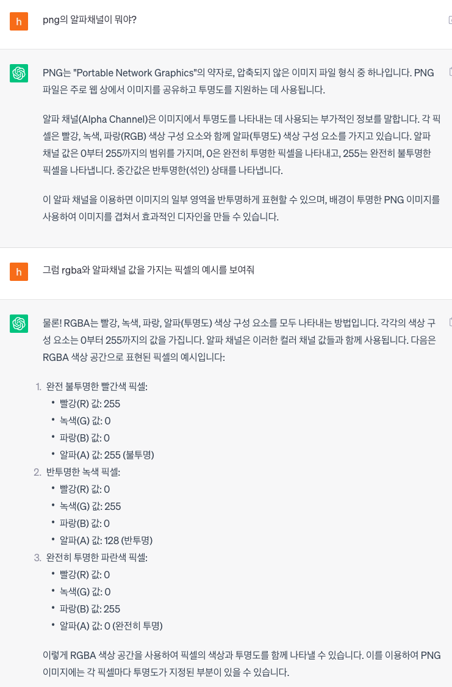
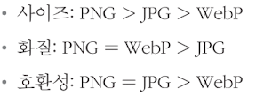
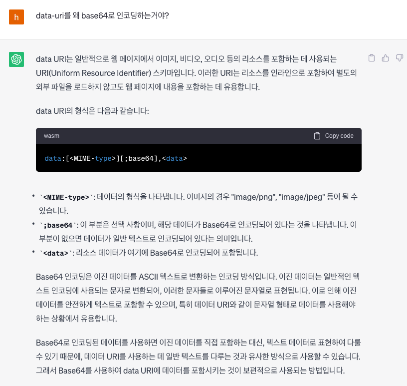

# 3. 홈페이지 최적화

# 분석 툴 소개

## Coverage 패널

- 웹 페이지를 렌더링하는 과정에서 어떤 코드가 실행되었는지 보여줌
- 그리고 각 파일의 코드가 얼마나 실행됐는지 비율로 나타내기때문에 파일이 얼마나 불필요한 코드를 가지고있는지 확인할 수 있음.

# 이미지 지연 로딩

- 첫 화면에 당장 필요하지 않은 이미지가 먼저 로드되지 않도록 지연시키는 기법

### Intersection Observer

- 브라우저 제공 api
- 웹 페이지의 특정 요소를 관찰하면 페이지 스크롤 시, 해당 요소가 화면에 들어왔는지 아닌지 알려준다.
- observer에 동시에 여러개의 대상을 관찰하도록 할 수 있음
- 원하는 동작이 실행완료되면 observer.disconnect 함수를 호출해서 리소스가 낭비되지않도록 하기

---

### dataset

- 표준이 아닌 속성이나 추가적인 DOM 속성
- 표준 HTML 요소에 추가 정보를 저장할 수 있도록 해줍니다.

> 여기서 data set을 사용한 이유

- img 태그에 바로 src를 넘겨주면 이미지가 바로 다운로드 되어버리기때문에 원하는 시점에 src를 set해주기위해서

# 이미지 사이즈 최적화

- 정적 이미지 최적화
- 느린 이미지 로딩 분석

## 이미지 포맷 종류

- 벡터 이미지 : SVG
- 비트맵 이미지 : PNG, JPG(JPEG), WebP

### PNG

- 무손실 압축 방식 - 원본을 훼손없이 압축하여 알파채널을 지원하는 이미지 포맷

<aside>
❓ **알파채널**
투명도. 배경을 투명하게 만들수있음



</aside>

### JPG

- 압축과정에서 손실이 발생 > 이미지를 작게 줄일수있다
- 고화질이어야하거나 투명도 정보가 필요한게아니라면 JPG

### WebP

- 무손실 압축과 손실 압축 모두를 제공하는 최신 이미지 포맷
- 브라우저 호환성때문에 지원하지 않는 브라우저에서의 처리가 필요함
- `picture` 태그를 사용! : 다양한 이미지를 렌더링하는 컨테이너로 사용한다.

```jsx
<picture>
	<source media="(min-width:650px)" srcset="img.jpg"/>
	<source media="(min-width:465px)" srcset="img.jpg"/>
	
</picture>

<picture>
	<source srcset="img.avif" type="image/avif"/>
	<source srcset="img.webp" type="image/webp"/>
	
</picture>

```

<aside>
❓ **previousSibling**
Node.previousSibling 은 읽기전용 속성이며 현재 호출하는 노드가 속해 있는 부모의 childNodes 목록에서 특정 자식 노드를 리턴하거나 childNodes 목록의 첫번째 노드일 경우 Null값을 리턴합니다. 라고 한다.
source는 여러개잇는데, 왜 sibling을 한번만 찾는것인가??? 에 대한 <a href="https://www.inflearn.com/questions/711407/%EC%9D%B4%EB%AF%B8%EC%A7%80-%EC%A7%80%EC%97%B0-%EB%A1%9C%EB%94%A9-%EC%A7%88%EB%AC%B8-%EC%9E%88%EC%8A%B5%EB%8B%88%EB%8B%A4">답변</a>
</aside>



# 동영상 최적화

- 동영상 파일은 파일크기가 크기때문에 당장 재생이 필요한 앞부분을 먼저 다운로드한 뒤 순차적으로 나머지 내용을 다운로드한다.

## 동영상 압축

- 동영상을 더 작은 사이즈로 압축하는 작업은 동영상의 화질을 낮추는 작업이다.
- 작성된 소스의 순서대로 실행가능한지 판단 후 사용된다.

```jsx
<video>
	<source src={~~} type="video/webm"/>
	<source src={~~} type="video/mp4"/>
</video>
```

- 프레임 레이트

# 폰트 최적화

- 커스텀 폰트를 사용할때 발생할 수 있는 문제를 보고 최적화하기

## FOUT (Flash of Unstyled Text)

- edge 브라우저에서 폰트를 로드하는 방식
- 폰트의 다운로드 여부와 상관없이 먼저 텍스트를 보여준 후 폰트가 다운로드되면 그때 폰트를 적용하는 방식

## FOIT (Flash of Invisible Text)

- 크롬, 사파리, 파이어폭스 등에서 폰트를 로드하는 방식으로 폰트가 완전히 다운로드되기전까지 텍스트자체를 보여주지 않는다. 그리고 폰트 다운로드가 완료되면 폰트가 적용된 텍스트를 보여준다.
- 하지만 크롬에서는 3초만 기다리는 FOIT이다.

## 폰트 최적화 방법

### 1. 폰트 적용 시점 제어하기

- 서비스나 콘텐츠의 특성에 맞게 적절한 방식을 적용해야한다.
- css의 font-display 속성을 이용하면 폰트가 적용되는 시점을 제어가능 (@font-face 내에서 사용가능)
  - auto : 브라우저 기본 동작
  - block : `FOIT` (timeout = 3s)
  - swap: `FOUT`
  - fallback : `FOIT` (timeout = 0.1s) / 3초 후에도 불러오지 못한 경우 기본 폰트로 유지, 이후 캐시
  - optional : `FOIT` (timeout = 0.1s) / 이후 네트워크 상태에따라 기본 폰트로 유지할지 결정, 이후 캐시

### 2. 폰트 사이즈 줄이기

- 폰트 파일 크기를 줄여 폰트가 다운로드되는 시간을 단축하는 방법
  - 압축률이 좋은 폰트 포맷을 사용하기
    
    - 폰트를 fallback방식으로 적용
  - 서브셋 폰트 사용(필요한 문자의 폰트만 로드하기)
    - 모든 문자가 아닌 일부 문자의 폰트 정보만 가지고 있는것을 서브셋 폰트라고 한다.
    - 이건 아마 알파벳 몇개의 폰트스타일정보만 가지고있는듯!

---

### 폰트를 파일형태가 아닌 Data-URI 형태로 CSS파일에 포함시키기

> **Data-URI**
> data 스킴이 접두어로 붙은 문자열 형태의 데이터.
> 파일을 문자열형태로 변환하여 문서에 인라인으로 삽입하는것
> 그럼 별도의 네트워크 로드없이 바로 폰트사용가능

- 폰트를 Data-URI형태로 추출하려면 Base64 encode 옵션을 On으로 해준다.

<aside>
❓ Data-URI랑 Base64랑 무슨상관인가?



</aside>

- 기본적으로 브라우저에서 네트워크 트래픽으로 인식해서 기록하지만 실재론 이미 다른 파일 내부에 임베드 되어있어 별도의 다운로드 시간이 필요하지않다.
- 하지만!!!!!!! Data-URI 형태가 항상 좋은것은 아니다. 폰트 내용은 App.css에 포함된것이므로 css파일의 다운로드 속도도 고려해야함
